## Instruction to run the application :


#### Install Following Python Libraries using pip :
Eg. pip install library_name
- flask
- flask_wtf
- PIL
- numpy
- pymysql


#### Install MySql Server
Link - https://dev.mysql.com/downloads/mysql/


# Database Settings

-Create Database
database name : bankdb
Edit username,password,databasename,hostname in config.ini file

Following Tables Should be Created :
> drop table PAYEE; \
> drop table CARDDETAILS; \
> drop table TRANSACTION; \
> drop table BANKDETAILS; \
> drop table CUSTOMER; \
> commit;


**CUSTOMER TABLE CREATION QUERIES**

```sql
CREATE TABLE CUSTOMER (CUSTOMERID INTEGER primary key auto_increment,
ACCOUNTNO VARCHAR(256) unique,
PASSWORD VARCHAR(256),
CUSTOMERNAME VARCHAR(256),
COUNTRY VARCHAR(256),
MOBILENO BIGINT,
EMAILID VARCHAR(256),
DATEOFBIRTH DATE,
LOGINSTATUS CHAR(1) CHECK(LOGINSTATUS IN ('Y','N')),
PROFILEPICTURE VARCHAR(256)
);
```


> ALTER TABLE CUSTOMER AUTO_INCREMENT = 10001;

**BANKDETAILS TABLE CREATION QUERIES**

```sql
CREATE TABLE BANKDETAILS (ACCOUNTNO VARCHAR(256) PRIMARY KEY,
BRANCHNAME VARCHAR(256),
IFSC VARCHAR(256),
BALANCE DOUBLE(40,2),
FOREIGN KEY (ACCOUNTNO) REFERENCES CUSTOMER(ACCOUNTNO) ON DELETE CASCADE
);
```

**TRANSACTION TABLE CREATION QUERIES**

```sql
CREATE TABLE TRANSACTION (ACCOUNTNO VARCHAR(256),
TRANSACTIONID BIGINT PRIMARY KEY auto_increment,
TRANSACTIONDATE DATETIME DEFAULT now(),
TRANSACTIONDETAILS VARCHAR(256),
AMOUNT DOUBLE(40,2),
TRANSACTIONTYPE CHAR(1) CHECK(TRANSACTIONTYPE IN ('C','D')),
BALANCE DOUBLE(40,2),
FOREIGN KEY (ACCOUNTNO) REFERENCES CUSTOMER(ACCOUNTNO) ON DELETE CASCADE
);
```


> ALTER TABLE TRANSACTION AUTO_INCREMENT = 1000000001;


**CARDDETAILS TABLE CREATION QUERIES**

```sql
CREATE TABLE CARDDETAILS ( ACCOUNTNO VARCHAR(256),
CARDNO VARCHAR(16) primary key,
CARDHOLDERNAME VARCHAR(30),
CARDTYPE CHAR(1) CHECK (CARDTYPE IN ('C','D')),
CVV INTEGER,
PIN INTEGER,
STATUS VARCHAR(10),
FOREIGN KEY(ACCOUNTNO) REFERENCES CUSTOMER(ACCOUNTNO) ON DELETE CASCADE
);
```


**PAYEE TABLE CREATION QUERIES**

```sql
CREATE TABLE PAYEE(ACCOUNTNO VARCHAR(256),
PAYEEACCOUNTNO VARCHAR(256),
PAYEENAME VARCHAR(256),
EMAILID VARCHAR(256),
BANKNAME VARCHAR(256),
BRANCHNAME VARCHAR(256),
IFSC VARCHAR(256),
FOREIGN KEY (ACCOUNTNO) REFERENCES CUSTOMER(ACCOUNTNO) ON DELETE CASCADE
);
```

> commit;


#### Snipptes


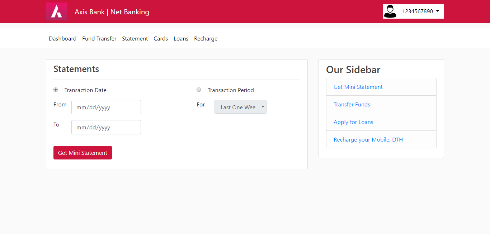
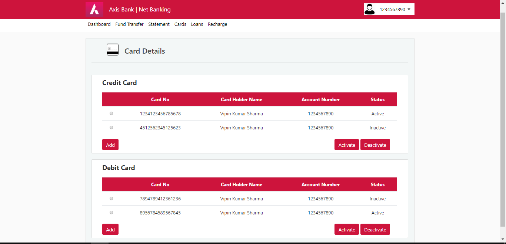
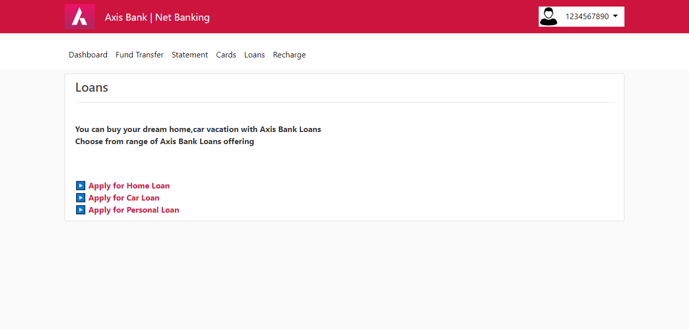
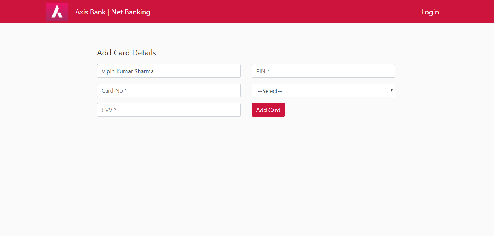
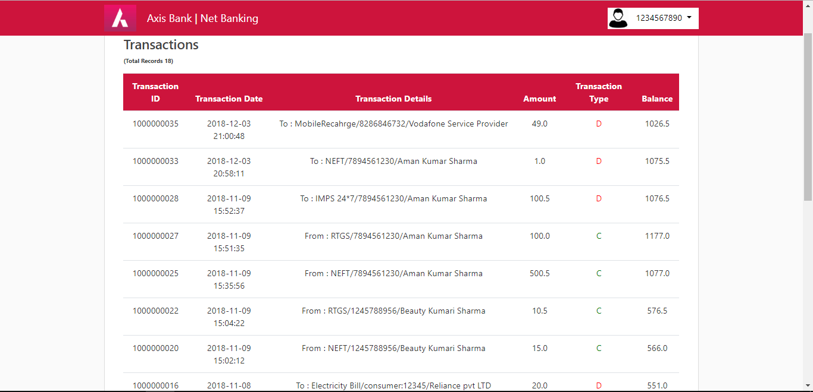
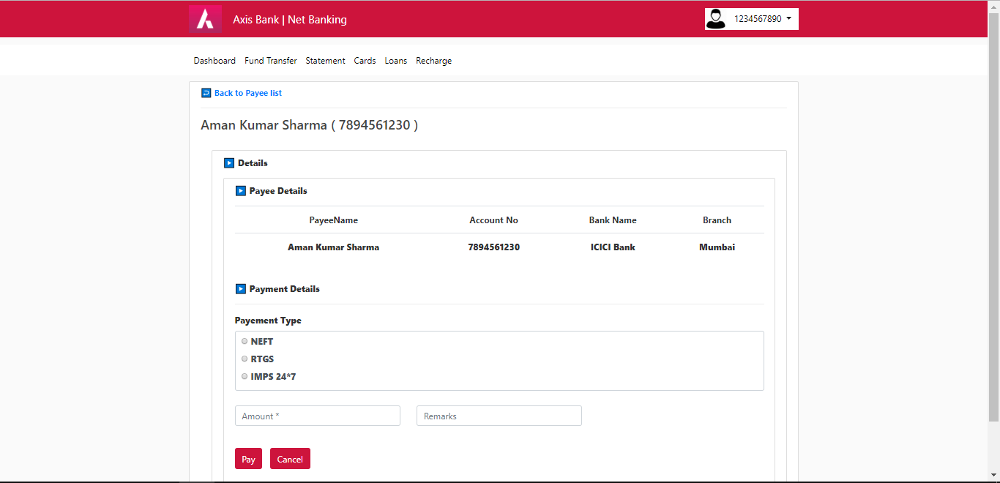
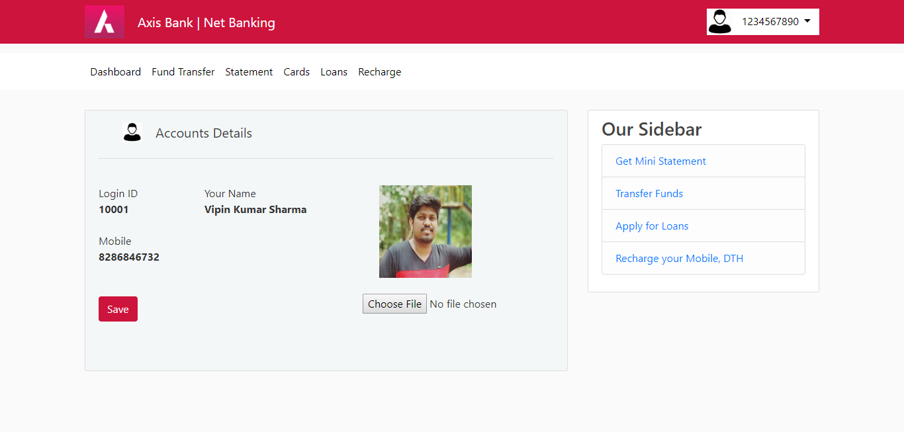
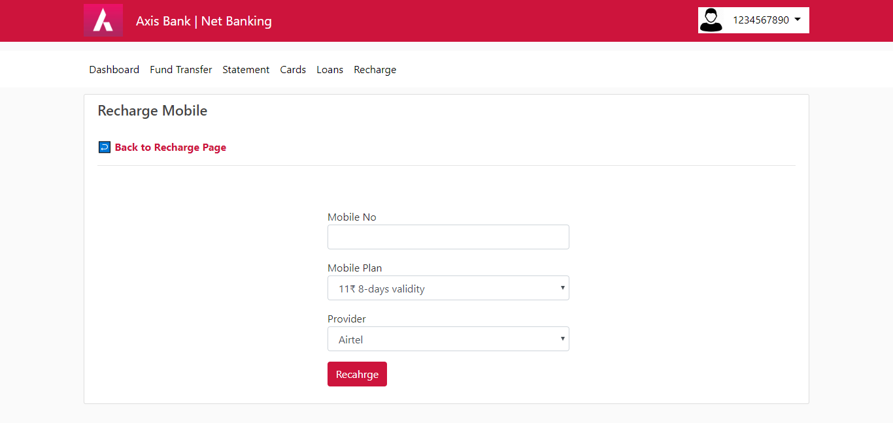
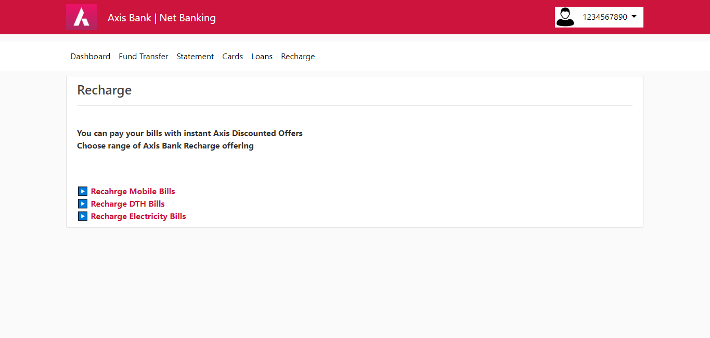

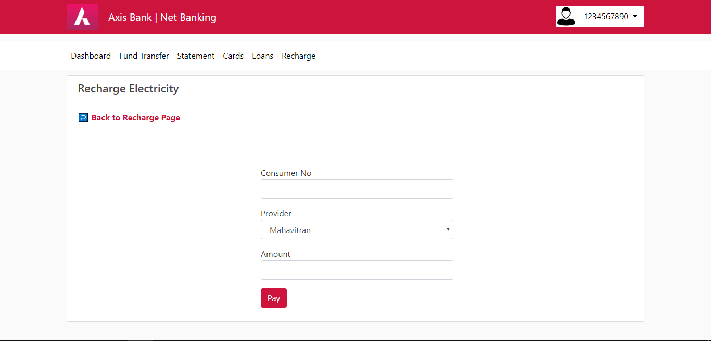
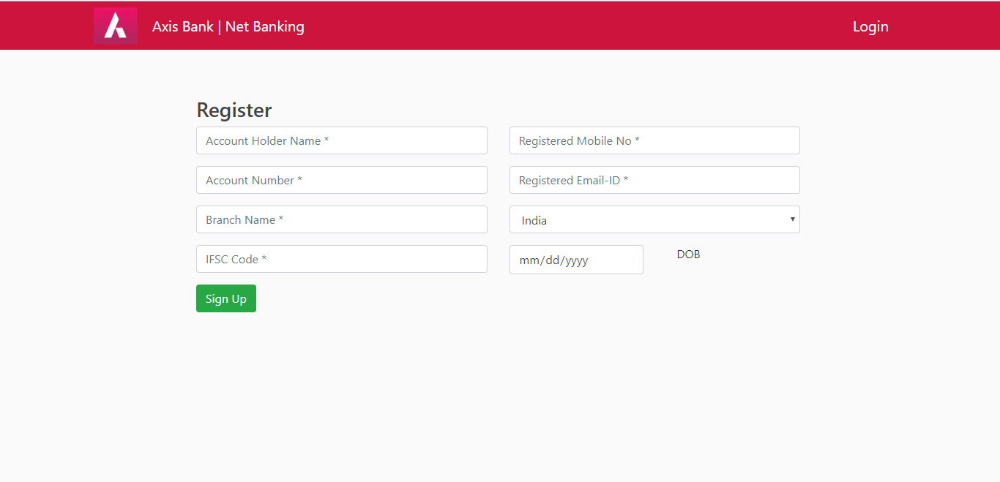


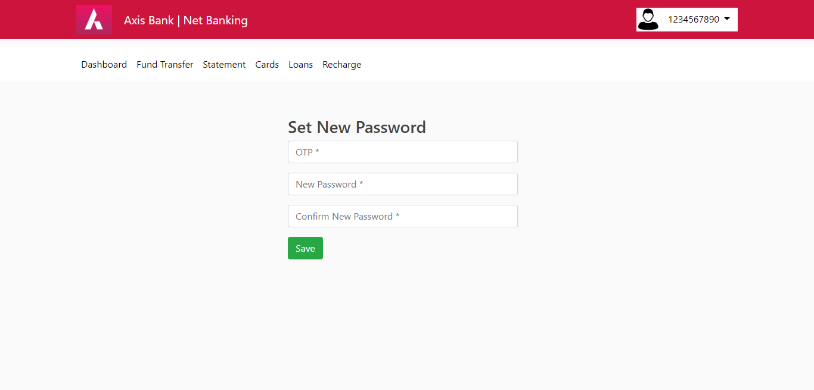
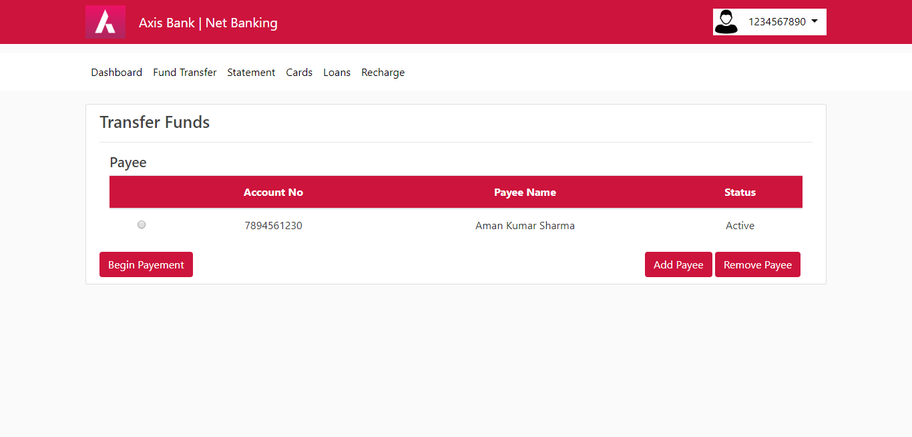
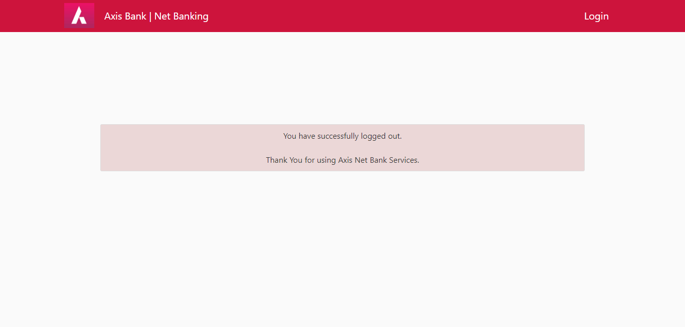


